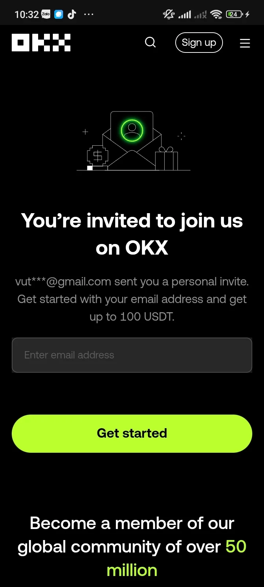

# Start Your Crypto Journey: Register an OKX Account and Claim Your 100 USDT Welcome Bonus

---

You know what's interesting about cryptocurrency exchanges these days? They're basically competing to give away free money just to get you in the door. And honestly, I'm not complaining. Right now, there's this pretty sweet deal where you can grab **100 USDT** just for setting up an account. Zero investment required. It's like finding money in your old jacket pocket, except it's digital and actually worth something.

Let me walk you through how this whole thing works, because it's simpler than you'd think.

---

## Why Bother With This Free 100 USDT Thing?

Here's the deal: most people hear "free crypto" and immediately think it's some elaborate scam. But this one's legit, and here's why it's actually worth your time:

**You're not risking anything.** That's the beautiful part. You get 100 USDT without putting down a single cent of your own money. It's basically the exchange saying, "Hey, try us out, here's some play money to get started."

**Real experience, real tools.** That 100 USDT isn't monopoly money. You can use it to mess around with actual trading tools, test out strategies without the stomach-churning fear of losing your savings. Think of it as a free driving lesson before you buy the car.

**Profit potential exists.** Look, I'm not going to tell you you'll become a crypto millionaire overnight. But that 100 USDT? It can actually grow if you play your cards right. The market's there, the opportunities exist. Some people turn small amounts into something meaningful. Others don't. But at least you're starting with house money.

## What You Actually Need to Do to Get That 100 USDT

Okay, so nothing's completely free – you do need to jump through a few hoops. But they're reasonable hoops, not flaming ones:

**Sign up for a new account.** Pretty straightforward. Email or phone number, your choice. Takes maybe two minutes if you type slowly.

**Complete KYC verification.** This is the identity verification thing. Yeah, I know, it feels a bit invasive. But exchanges have to do this – it's regulation stuff, keeping things legitimate. You'll need to upload some ID documents. Most people get through it in under ten minutes.

**Finish the qualifying tasks.** This might mean making a small deposit or doing a bit of trading. Sometimes it's just participating in a promotional event. The specific requirements vary, but they're designed to be achievable, not impossible.

## Here's How You Actually Do This Step-by-Step

**Step 1: Hit the Registration Page**

First things first – you need to get to the sign-up page. 👉 [Click here to start your account setup and unlock your 100 USDT welcome bonus](https://www.okx.com/join/47044926)

**Step 2: Fill in Your Details**

Type in your email address. Read the terms and conditions (or, you know, at least scroll through them like everyone else does). Check the box. Done.

**Step 3: Get Through KYC Verification**

This is where you prove you're a real human being and not a sophisticated bot trying to claim infinite free crypto. You'll need:

- Some form of government ID – passport, driver's license, national ID card
- Clear photos of said ID (not blurry shots taken in a dark room)
- Maybe a selfie holding the ID, depending on verification level

Upload everything, wait a bit for the system to process it. Usually takes anywhere from a few minutes to a couple hours.

**Step 4: Complete the Final Requirements**

Make that minimum deposit if required, or complete whatever simple tasks the exchange asks for. Once you've ticked all the boxes, boom – that 100 USDT shows up in your account. It's a nice feeling.

## How to Actually Make This 100 USDT Work for You

So you've got your 100 USDT sitting there. Now what? Here are some ideas that don't involve immediately losing it all:

**Invest with some actual thought behind it.** Research coins that have real use cases, not just meme potential. Look at market trends. Read up on projects. Don't just throw darts at a board and hope one sticks.

**Spread things out.** Don't dump all 100 USDT into one random altcoin someone mentioned in a Telegram group. Diversify. Maybe split it across a few different assets. If one tanks, you're not completely wiped out.

**Treat this as your learning account.** Seriously, this is free money for education. Test strategies. Try different order types. Figure out how stop losses work. Make mistakes with money that wasn't yours to begin with. That's the whole point.

---

## The Bottom Line

Look, getting started with cryptocurrency can feel intimidating. There's a lot of jargon, lots of people pretending they know more than they do, and plenty of ways to mess things up. But this 100 USDT offer? It's basically a risk-free entry point into the whole ecosystem.

You're not putting your own money on the line. You're getting hands-on experience with real trading tools. And if things go well, you might actually turn that free 100 USDT into something more substantial.

The crypto market isn't going anywhere. Might as well dip your toes in while someone else is paying for the privilege. 👉 [Get started with OKX now and claim your 100 USDT – it's the easiest way to begin trading without financial risk](https://www.okx.com/join/47044926).
